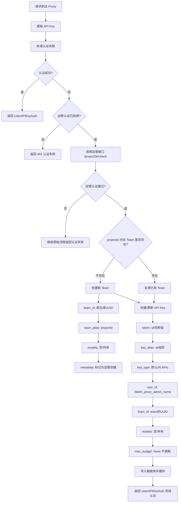
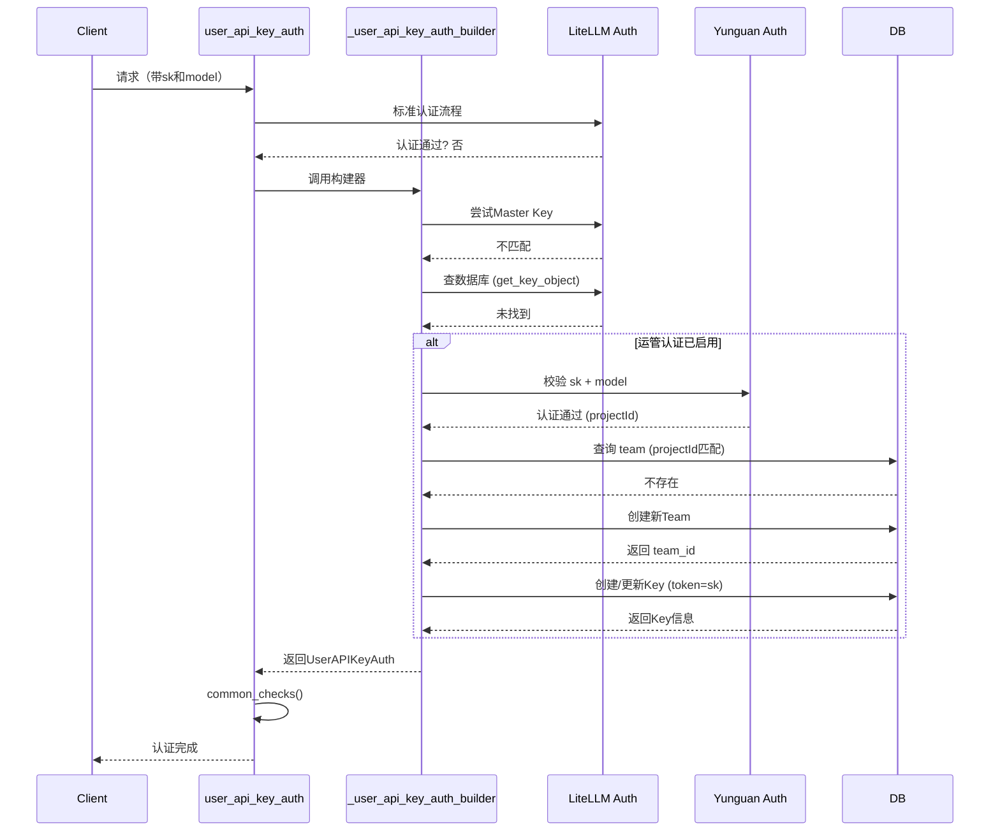
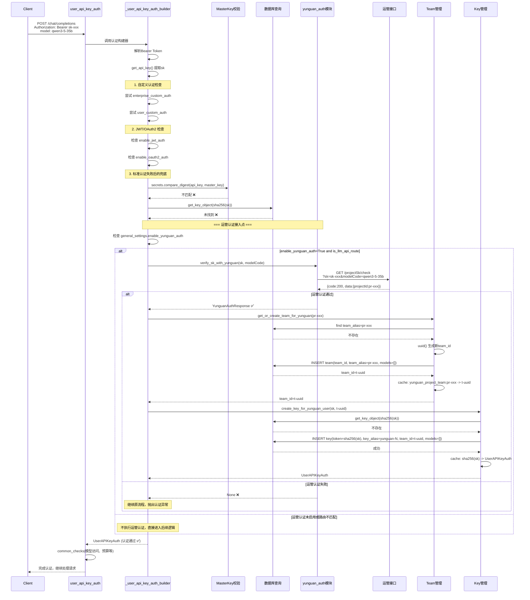

# LiteLLM 运管认证集成设计方案

## 1. 需求概述

在 LiteLLM Proxy 的 API Key 认证流程中，当标准认证（Master Key、数据库查询）都失败后，增加运管接口的兜底认证逻辑。通过运管接口校验 SK 和模型名称，若认证通过则自动创建/复用 Team 和 API Key，使运管系统的密钥能够无缝接入 LiteLLM。

## 2. 整体设计流程



## 3. 关键决策说明

### 3.1 Team ID 与 Team Alias 策略
- **team_id**: 使用新生成的 UUID（LiteLLM 内部使用）
- **team_alias**: 使用运管返回的 `projectId`（如 `pr-1228421016223940608`）
- `projectId` 同时存入 `metadata` 中作为溯源标识

### 3.2 用户归属策略
- 使用 `litellm_proxy_admin_name`（默认值为 `LITELLM_PROXY_ADMIN_NAME`）作为创建者/绑定用户
- 避免每次认证时创建新用户，减少数据库负担

### 3.3 models 配置策略
- Team 的 models 设置为空列表 `[]`（表示允许所有模型，无限制）
- 后续可通过运管接口返回的 `freeModel` 字段等扩展为限定模型

### 3.4 Key 的 token 值策略
- 使用传入的 `sk` 作为 token（即数据库中存储 sk 的 SHA-256 哈希）
- key_name 使用 sk 的缩写（前4+后4字符）
- 这样用户后续使用相同的 sk 请求时，LiteLLM 的数据库查询就能命中

## 4. 配置方式

在 `config.yaml` 的 `general_settings` 中配置：

```yaml
general_settings:
  # 启用运管认证兜底
  enable_yunguan_auth: true
  # 运管接口基地址
  yunguan_base_url: "https://zjic.zhejianglab.com"
  # 运管认证接口路径（相对于基地址）
  yunguan_auth_path: "/apis/control-zjic/projectSk/check"
```

## 5. 核心流程时机（切入点）

在 `user_api_key_auth.py` 中的切入点选择：



## 6. 新增文件与修改文件清单

### 6.1 新增文件

| 文件路径 | 说明 |
|---------|------|
| `litellm/proxy/auth/yunguan_auth.py` | 运管认证核心模块，封装HTTP调用和认证逻辑 |
| `plans/yunguan_auth_integration_design.md` | 本设计文档 |

### 6.2 修改文件

| 文件路径 | 说明 |
|---------|------|
| `litellm/proxy/auth/user_api_key_auth.py` | 在 `_user_api_key_auth_builder` 中，数据库查询失败后、抛出认证异常前，插入运管认证逻辑 |
| `litellm/proxy/management_endpoints/team_endpoints.py` | 若 `new_team` 函数为私有或难以直接调用，可能需要新增内部辅助函数用于创建 team（若已有可复用逻辑则不需要） |

## 7. `yunguan_auth.py` 设计

```python
"""
运管认证模块
提供运管接口校验和 Team/Key 自动创建功能
"""
import asyncio
from typing import Optional
import httpx
from litellm._logging import verbose_proxy_logger
from litellm.proxy._types import (
    UserAPIKeyAuth,
    ProxyException,
    ProxyErrorTypes,
)

class YunguanAuthConfig:
    """运管认证配置"""
    base_url: str
    auth_path: str
    timeout: int = 10
    
class YunguanAuthResponse:
    """运管认证返回数据结构"""
    sk: str
    token_total: float
    expire_time: str
    project_sk_id: int
    sk_type: str
    project_id: str
    quota_used: float
    free_model: bool
    success: bool

async def verify_sk_with_yunguan(
    sk: str,
    model_name: Optional[str],
    config: YunguanAuthConfig,
) -> Optional[YunguanAuthResponse]:
    """
    调用运管接口校验SK
    
    Args:
        sk: API Key
        model_name: 模型名称（从请求中提取）
        config: 运管配置
    
    Returns:
        认证通过返回YunguanAuthResponse，失败返回None
    """
    url = f"{config.base_url}{config.auth_path}"
    params = {"sk": sk}
    if model_name:
        params["modelCode"] = model_name
    
    verbose_proxy_logger.info(f"调用运管接口认证: {url}, sk={sk[:8]}...")
    
    async with httpx.AsyncClient(timeout=config.timeout) as client:
        try:
            response = await client.get(url, params=params)
            response.raise_for_status()
            data = response.json()
            
            if data.get("code") != "200" or not data.get("success", False):
                verbose_proxy_logger.warning(f"运管认证失败: {data.get('message')}")
                return None
            
            result_data = data.get("data", {})
            return YunguanAuthResponse(
                sk=result_data.get("sk", sk),
                token_total=result_data.get("tokenTotal", 0),
                expire_time=result_data.get("expireTime", ""),
                project_sk_id=result_data.get("projectSkId"),
                sk_type=result_data.get("skType", ""),
                project_id=result_data.get("projectId", ""),
                quota_used=result_data.get("quotaUsed", 0),
                free_model=result_data.get("freeModel", False),
                success=True,
            )
        except Exception as e:
            verbose_proxy_logger.error(f"调用运管接口异常: {e}")
            return None


async def get_or_create_team_for_yunguan(
    project_id: str,
    yunguan_response: YunguanAuthResponse,
    prisma_client,
    user_api_key_cache,
) -> str:
    """
    根据projectId获取或创建Team
    
    Returns:
        team_id: UUID格式的团队ID
    """
    # 1. 先通过缓存查找（根据projectId映射）
    cache_key = f"yunguan_project_team:{project_id}"
    cached_team_id = await user_api_key_cache.async_get_cache(cache_key)
    if cached_team_id:
        verbose_proxy_logger.info(f"命中运管Team缓存: project={project_id}, team={cached_team_id}")
        return cached_team_id
    
    # 2. 通过数据库查找（通过team_alias匹配projectId）
    from litellm.proxy.auth.auth_checks import get_team_object
    
    # 由于 get_team_object 需要 team_id（不是team_alias），
    # 需要先通过 prisma 查询 team_alias = projectId
    existing_team = await prisma_client.db.litellm_teamtable.find_first(
        where={"team_alias": project_id}
    )
    
    if existing_team:
        team_id = str(existing_team.team_id)
        await user_api_key_cache.async_set_cache(cache_key, team_id)
        verbose_proxy_logger.info(f"查找到现有Team: project={project_id}, team={team_id}")
        return team_id
    
    # 3. 创建新Team
    from litellm._uuid import uuid
    from litellm.proxy._types import NewTeamRequest
    from litellm.proxy.management_endpoints.team_endpoints import new_team_helper
    from litellm.proxy.proxy_server import litellm_proxy_admin_name
    
    new_team_id = str(uuid())
    team_request = NewTeamRequest(
        team_id=new_team_id,
        team_alias=project_id,
        models=[],  # 允许所有模型
        metadata={
            "yunguan_project_id": project_id,
            "yunguan_source": True,
            "yunguan_project_sk_id": yunguan_response.project_sk_id,
        },
    )
    
    # 使用 new_team 辅助函数创建（绕过HTTP端点，直接DB操作）
    await new_team_helper(
        data=team_request,
        user_api_key_dict=None,  # 内部调用，无需认证
        prisma_client=prisma_client,
    )
    
    await user_api_key_cache.async_set_cache(cache_key, new_team_id)
    verbose_proxy_logger.info(f"创建新Team: project={project_id}, team={new_team_id}")
    return new_team_id


async def create_key_for_yunguan_user(
    sk: str,
    team_id: str,
    project_id: str,
    yunguan_response: YunguanAuthResponse,
    prisma_client,
    user_api_key_cache,
    proxy_logging_obj=None,
) -> UserAPIKeyAuth:
    """
    为运管用户创建LiteLLM API Key
    
    Args:
        sk: 原始sk（作为token值存储）
        team_id: 关联的team UUID
        project_id: 运管projectId
        
    Returns:
        UserAPIKeyAuth: 认证对象
    """
    from litellm.proxy.management_endpoints.key_management_endpoints import (
        generate_key_helper_fn,
    )
    from litellm.proxy.utils import hash_token
    from litellm.constants import LITELLM_PROXY_ADMIN_NAME
    from litellm.proxy.auth.auth_checks import get_key_object
    
    # 1. 先检查数据库中是否已存在用此sk创建的key
    sk_hash = hash_token(sk)
    
    try:
        existing_key = await get_key_object(
            hashed_token=sk_hash,
            prisma_client=prisma_client,
            user_api_key_cache=user_api_key_cache,
            proxy_logging_obj=proxy_logging_obj,
        )
        verbose_proxy_logger.info(f"查找到现有运管Key: {sk[:8]}...")
        return existing_key
    except Exception:
        verbose_proxy_logger.info(f"未找到现有Key，创建新Key: {sk[:8]}...")
    
    # 2. 使用 generate_key_helper_fn 创建新Key
    # 注意：这里需要传入原始sk作为 token 参数，让系统使用此值而非自动生成
    key_result = await generate_key_helper_fn(
        request_type="key",
        token=sk,  # 使用原始sk作为token（会被哈希存储）
        key_alias=f"yunguan-{yunguan_response.project_sk_id}",
        user_id=LITELLM_PROXY_ADMIN_NAME,
        team_id=team_id,
        models=[],  # 允许所有模型
        max_budget=None,  # 不限制预算（由运管控制）
        metadata={
            "yunguan_sk": True,
            "yunguan_project_id": project_id,
            "yunguan_sk_type": yunguan_response.sk_type,
        },
        prisma_client=prisma_client,
        user_api_key_cache=user_api_key_cache,
        table_name="key",
    )
    
    # 3. 构建返回对象
    # key_result 包含 key 值和 token
    # 需要将其组装为 UserAPIKeyAuth
    return key_result
```

## 8. `user_api_key_auth.py` 修改点

在 `_user_api_key_auth_builder` 函数中的修改位置：

```python
# 当前逻辑流程（数据库查询Key失败后）:
# 1. 检查 cache -> 2. 检查 UI Hash -> 3. 检查 Master Key -> 4. 检查数据库
# 在以下位置（约1280行后）插入运管认证逻辑

# 新增逻辑：
if general_settings.get("enable_yunguan_auth", False) is True:
    # 只有推理接口才走运管认证（模型请求路由）
    if RouteChecks.is_llm_api_route(route=route):
        from litellm.proxy.auth.yunguan_auth import (
            YunguanAuthConfig,
            verify_sk_with_yunguan,
            get_or_create_team_for_yunguan,
            create_key_for_yunguan_user,
        )
        
        # 提取模型名称
        model = _get_model_from_request_context(
            request_data=request_data,
            route=route,
            request=request,
        )
        model_name = model[0] if isinstance(model, list) else model
        
        # 调用运管接口校验
        yunguan_config = YunguanAuthConfig(
            base_url=general_settings.get("yunguan_base_url"),
            auth_path=general_settings.get("yunguan_auth_path", "/apis/control-zjic/projectSk/check"),
        )
        
        yunguan_result = await verify_sk_with_yunguan(
            sk=api_key,
            model_name=model_name,
            config=yunguan_config,
        )
        
        if yunguan_result is not None:
            project_id = yunguan_result.project_id
            
            # 获取或创建Team
            team_id = await get_or_create_team_for_yunguan(
                project_id=project_id,
                yunguan_response=yunguan_result,
                prisma_client=prisma_client,
                user_api_key_cache=user_api_key_cache,
            )
            
            # 创建Key（或复用已有Key）
            valid_token = await create_key_for_yunguan_user(
                sk=api_key,
                team_id=team_id,
                project_id=project_id,
                yunguan_response=yunguan_result,
                prisma_client=prisma_client,
                user_api_key_cache=user_api_key_cache,
                proxy_logging_obj=proxy_logging_obj,
            )
            
            # 构建返回的认证对象
            if valid_token is not None:
                valid_token.parent_otel_span = parent_otel_span
                return valid_token

# 原有逻辑继续：如果运管认证也失败，则抛出异常
```

## 9. 时序详图



## 10. 注意事项与风险

### 10.1 并发安全
- 多个请求同时使用同一个新sk时，可能同时创建多个Team/Key
- 方案：使用数据库 `UNIQUE` 约束（token字段已有唯一约束，`team_id` + `team_alias` 也需要考虑）
- LiteLLM 的 `token` 字段已有 `UNIQUE` 约束，第二个请求创建会失败，可以捕获唯一键异常，重试查询现有记录

### 10.2 性能影响
- 每次认证失败时才发起HTTP请求，对正常请求无影响
- 运管接口响应时间应在可接受范围内（建议设置超时10秒）
- Team/Key创建后立即缓存，后续请求走缓存

### 10.3 错误处理
- 运管接口不可用时，静默失败，继续原始认证流程
- 创建Team/Key失败时，应记录详细日志
- 运管认证失败后不阻断流程，回退到标准401

### 10.4 Key 过期处理
- LiteLLM 创建的Key会继承运管接口返回的 `expireTime`
- 可设置LiteLLM的 `expires` 字段与运管过期时间同步
- 或依赖运管的额度控制，LiteLLM仅做权限校验

## 11. 扩展考虑

### 11.1 额度同步
后续可扩展实现：
- 定期同步运管的 `tokenTotal` - `quotaUsed` 到 LiteLLM 的 Key 预算
- 在LiteLLM的Key上设置max_budget等于运管剩余额度

### 11.2 模型映射
根据 `freeModel` 字段或运管的模型限制，自动配置Team和Key的 `models` 列表

### 11.3 审计日志
所有通过运管认证创建的Team/Key应记录审计日志，包含：
- 运管projectId
- 创建时间  
- 关联的sk前缀
